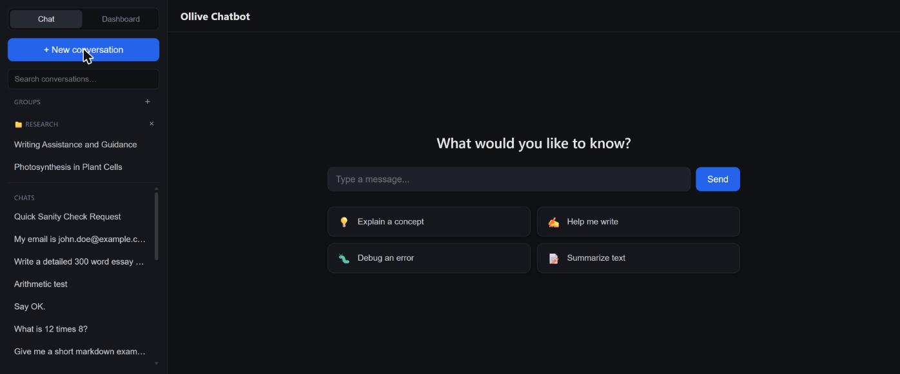
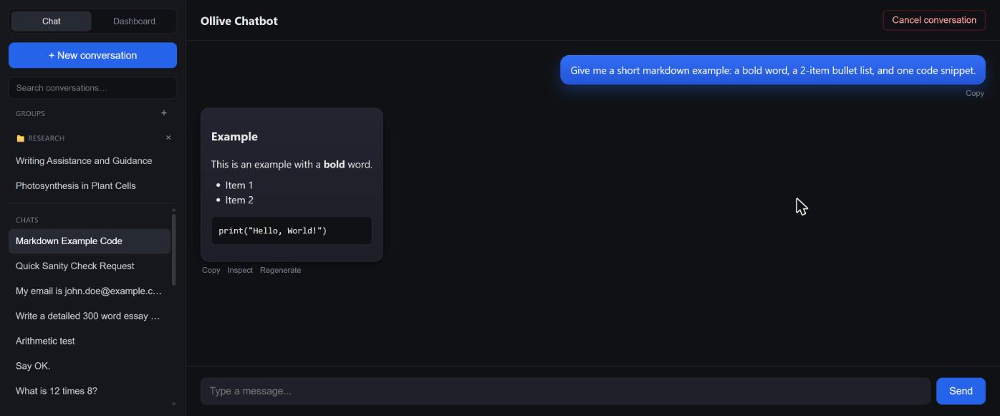
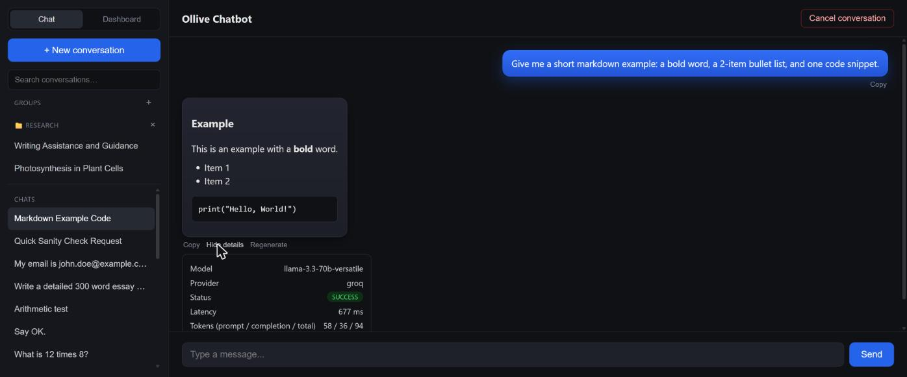
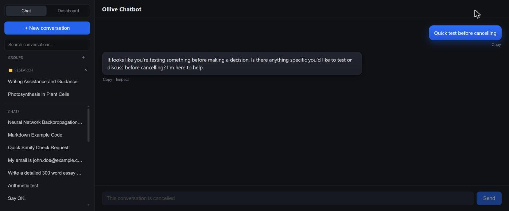
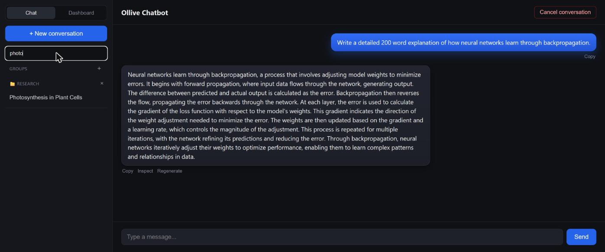
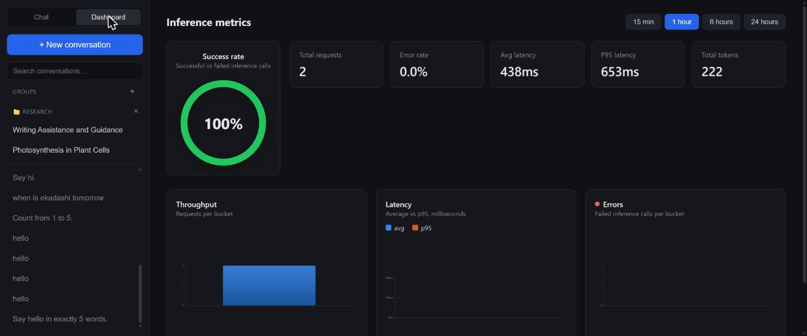
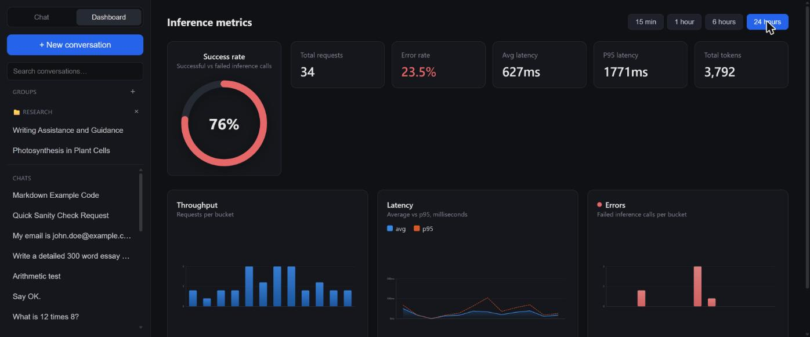
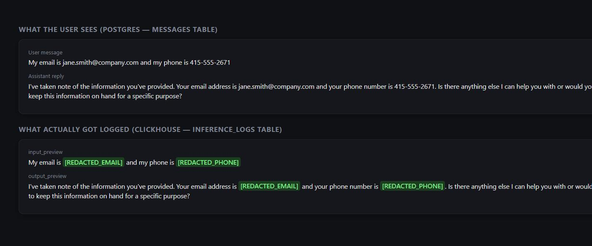
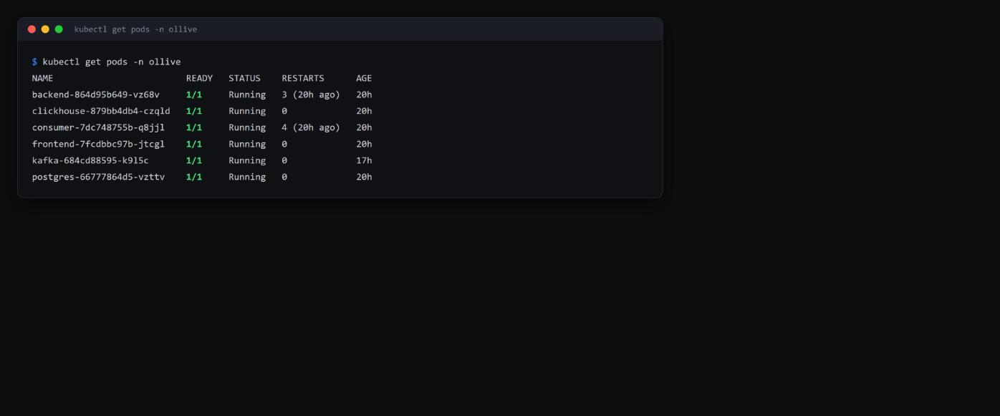

# Ollive Inference Logger

A chatbot with an auto-instrumenting SDK and an event-driven ingestion pipeline
for LLM inference logs — plus a metrics dashboard, PII redaction, streaming
responses, and a Kubernetes deployment.

- **Chatbot**: multi-turn, streaming chat backed by Groq (Llama 3.3 70B), with
  markdown rendering, regenerate, per-message inference inspection, conversation
  rename/search/cancel
- **SDK**: a decorator that wraps any LLM provider call (streaming or not) and
  captures latency, token usage, status, and I/O previews with zero call-site
  logging code — PII in those previews is redacted before it ever leaves the process
- **Ingestion**: HTTP endpoint → Kafka → consumer → ClickHouse, decoupled so a slow
  or down analytics store never blocks a chat request
- **Storage**: Postgres for conversations/messages (OLTP), ClickHouse for inference
  logs (OLAP)
- **Dashboard**: latency / throughput / error-rate charts read live off ClickHouse
- **Deployment**: one-command Docker Compose for local dev, Kubernetes manifests
  for a self-hosted cluster

## Screenshots

| | |
|---|---|
|  **New conversation** — centered composer + starter prompts, sidebar groups |  **Markdown rendering** — streamed response with an auto-generated conversation title |
|  **Inspect panel** — actual latency/tokens/model logged for that response, read straight from ClickHouse |  **Cancel** — blocks new messages, history stays fully readable |
|  **Search** — client-side filtering across conversations and groups |  **Dashboard (1h)** — success-rate gauge, throughput, latency (avg/p95), and error charts, all live off ClickHouse |
|  **Dashboard (24h)** — same charts over a longer window, showing the real error/latency variance across the session |  **PII redaction** — real chat content vs. what actually landed in `inference_logs` for the same message |
|  **Kubernetes** — the full stack (Postgres, ClickHouse, Kafka, backend, consumer, frontend) running on a self-hosted cluster | |

<sub>Screenshots 08–09 are rendered from real command output/query results (styled to match the app's theme) rather than raw terminal captures — the data itself (redacted log content, pod status) is exactly what the commands returned.</sub>

## Architecture

```
                     ┌──────────────┐
   Browser  ───────► │   frontend    │  React (Vite)
                     └──────┬───────┘
                            │ REST + SSE (streaming)
                            ▼
                     ┌──────────────┐        ┌─────────────┐
                     │   backend     │───────►│   Postgres   │  conversations,
                     │ (Django+DRF)  │        │              │  messages
                     └──────┬───────┘        └─────────────┘
                            │ complete_chat() / stream_chat()
                            │ @log_inference / @log_inference_stream (sdk/llm_logger.py)
                            │ — PII-redacted previews (sdk/pii_redaction.py)
                            ▼
                     ┌──────────────┐
                     │  Groq API     │
                     └──────────────┘
                            │
                            │ fire-and-forget POST (metadata only)
                            ▼
                     ┌──────────────┐
                     │ /api/ingest/  │  validate + parse (DRF serializer)
                     └──────┬───────┘
                            │ produce
                            ▼
                     ┌──────────────┐
                     │  Kafka topic  │  inference-logs
                     │ inference-logs│
                     └──────┬───────┘
                            │ poll + batch
                            ▼
                     ┌──────────────┐        ┌─────────────┐
                     │   consumer    │───────►│  ClickHouse  │  inference_logs
                     │ (mgmt command)│        │              │◄──┐
                     └──────────────┘        └─────────────┘   │
                                                     ▲            │ aggregation queries
                                                     └── /api/metrics/* ──┘ (dashboard)
```

## Setup (Docker Compose — local dev)

Prerequisites: Docker Desktop.

```bash
cp backend/.env.example backend/.env      # fill in GROQ_API_KEY
docker compose up -d --build

# first run only: create the initial Django migration/tables
docker compose run --rm backend python manage.py makemigrations chat
docker compose restart backend consumer
```

- Frontend: http://localhost:5173
- Backend API: http://localhost:8000/api
- ClickHouse HTTP: http://localhost:8123 (user `default`, password from `backend/.env`)

Get a free Groq API key at https://console.groq.com.

## Kubernetes deployment (self-hosted cluster)

Manifests live in `k8s/` (plain YAML + a `kustomization.yaml`, no Helm). Tested
against Docker Desktop's built-in Kubernetes (kind under the hood) — works
against any self-hosted cluster the same way.

```bash
# 1. Build images the manifests reference
docker build -t ollive-backend:latest ./backend
docker build -t ollive-frontend:latest ./frontend

# 2. Provide secrets (never commit real values)
cp k8s/secret.example.yaml k8s/secret.yaml
# edit k8s/secret.yaml: GROQ_API_KEY, and the Postgres/ClickHouse/Django secrets

# 3. Deploy everything
kubectl apply -k k8s/

# 4. Watch it come up
kubectl get pods -n ollive -w
```

Backend and frontend are `type: ClusterIP` — reach them with `kubectl
port-forward` (avoids colliding with Docker Compose if both are running
locally at once, and needs no ingress controller for this scope):

```bash
kubectl port-forward -n ollive svc/backend 18000:8000
kubectl port-forward -n ollive svc/frontend 15173:5173
```

Run the one-time migration the same way as Compose, against the cluster:

```bash
kubectl exec -n ollive deploy/backend -- python manage.py makemigrations chat
kubectl rollout restart deployment/backend deployment/consumer -n ollive
```

Notes on how the k8s setup differs from Compose:
- Postgres and ClickHouse get real `PersistentVolumeClaim`s (Compose used named
  volumes, which is roughly the same idea, just simpler).
- Kafka's `KAFKA_CONTROLLER_QUORUM_VOTERS` points at `localhost:9093` rather
  than the `kafka` Service — self-traffic through a ClusterIP can fail to
  hairpin back to the same pod on some CNIs, which showed up as a
  `CrashLoopBackOff` during testing. Since this is a single-broker/controller
  node, the voter only ever needs to reach itself, so `localhost` sidesteps
  the Service entirely; client traffic from other pods still goes through the
  `kafka` Service as normal.
- Backend and consumer share one image (`ollive-backend`); which process runs
  is selected by `args: ["web"]` / `args: ["worker"]`, mirroring the
  `entrypoint.sh` dispatch used in Compose.

## Chat features

- **Streaming** (`POST /api/chat/stream/`, SSE): tokens render as they arrive;
  a client-side "Stop" button aborts the fetch, which the backend observes as
  a write failure on its next generator step and stops pulling further tokens
  from Groq — best-effort cancellation, not an instant kill switch.
- **Regenerate** (`POST /api/conversations/<id>/regenerate/`): drops the last
  assistant reply and re-streams a fresh one for the same trailing user
  message.
- **Inspect**: every assistant message has an "Inspect" action that fetches
  the actual latency/tokens/model/status ClickHouse recorded for the
  inference call that produced it (`GET /api/messages/<id>/inference/`) — the
  chat UI reads directly from the observability pipeline built for this project.
- **Rename / search / cancel**: conversation list supports inline rename
  (double-click), client-side search, and cancelling (blocks new messages,
  history stays readable). Cancelled conversations are visually distinct
  (red-tinted) and grouped into their own sidebar section rather than
  interleaved with active ones.
- **Groups**: sidebar folders for organizing conversations
  (`ConversationGroup` model, `/api/groups/`). Each conversation gets a
  hover-revealed "move to group" selector; deleting a group ungroups its
  conversations rather than deleting them (`on_delete=SET_NULL`).
- **Starter prompts**: a brand-new conversation shows a centered composer with
  a few example prompts instead of an empty screen; the composer moves to its
  normal bottom-anchored position once the first message is sent.
- **Markdown rendering** via `react-markdown` + `remark-gfm` for assistant
  responses (code blocks, lists, tables).
- **Contextual titles**: a new conversation's title is generated from the
  actual exchange (`generate_title` in `groq_client.py`) via a short Groq
  call once the first reply completes, rather than truncating the first
  message. That call goes through the same `@log_inference` path as regular
  chat completions — tagged `metadata.purpose: "title_generation"` — so it
  shows up in the dashboard/logs like any other inference rather than being
  invisible extra usage.

## Dashboard

`GET /api/metrics/summary/?window=1h` and `/api/metrics/timeseries/?window=1h`
(`window` ∈ `15m|1h|6h|24h`) run aggregation queries directly against
ClickHouse (`count()`, `countIf(status='error')`, `quantile(0.5|0.95|0.99)`,
`toStartOfInterval` for bucketing) — no separate metrics store. The frontend
Dashboard tab polls both every 15s and renders stat tiles plus throughput,
latency (avg/p95), and error charts with hover tooltips.

## PII redaction

`sdk/pii_redaction.py` regex-redacts emails, phone numbers, credit-card-shaped
digit runs, SSNs, IPs, and API-key-shaped tokens **in the log previews only**
(`sdk/llm_logger.py`'s `_preview()`), before they're sent to `/api/ingest/`.
The actual chat content in Postgres and shown to the user is never touched —
this protects the observability pipeline, not the product itself. Regex
redaction is inherently incomplete (it can't catch PII with no fixed shape,
e.g. a name) — see "what I'd improve" below.

## Ingestion flow

1. `chat/services/groq_client.py` calls Groq, wrapped by `@log_inference("groq")`
   or `@log_inference_stream("groq")` from `sdk/llm_logger.py`. The decorator is
   the *entire* integration — the call site does no logging itself, which is
   what lets any future provider be "auto-instrumented" by wrapping its client
   call the same way.
2. The decorator times the call, builds a metadata payload (model, provider,
   latency, tokens, status, timestamps, conversation/message id, redacted
   input/output previews truncated to 500 chars), and fires an async-style POST
   to `/api/ingest/`. Failure to deliver a log never raises — it's swallowed and
   logged locally, so observability can't break the chat path.
3. `ingestion/views.py` (`IngestLogView`) validates/parses the payload with a DRF
   serializer and publishes it onto the Kafka topic `inference-logs`. This view
   does no persistence itself — publishing is the only side effect, so it stays
   fast regardless of downstream storage health.
4. `ingestion/management/commands/consume_inference_logs.py` polls Kafka,
   batches events (up to 50, or every 2s), and bulk-inserts them into ClickHouse.
   Offsets are committed manually, only after a batch is durably written —
   at-least-once delivery. A crash between flush and commit can replay a few
   rows (duplicates) on restart, which is far cheaper for a log table than
   silently losing rows.

## Schema design decisions

**Postgres — `conversations` / `messages`** (OLTP, source of truth for chat)
- Normalized, low-volume, needs relational integrity (a message must belong to
  a conversation) and point lookups (resume a conversation by id) — a classic
  relational workload.
- `conversations.status` (`active`/`cancelled`) is a plain column rather than a
  soft-delete flag, since a cancelled conversation is still fully readable
  (resume/history), just no longer accepts new messages.

**ClickHouse — `inference_logs`** (OLAP, high-volume analytics/observability)
- Append-only event stream, queried mostly by time range and aggregated
  (latency/throughput/error-rate dashboards) — the workload ClickHouse is built
  for, and Postgres would not scale as well for this at high log volume.
- `MergeTree`, partitioned by month, ordered by `created_at`. `conversation_id`
  was deliberately left out of the sort key: ClickHouse's `MergeTree` sorting
  key can't contain nullable columns (a log can exist without a conversation —
  e.g. a request that failed before one was created), and the dashboard access
  pattern is time-range-first anyway.
- A free-form `metadata JSON` column (finish reason, provider request id,
  time-to-first-token for streamed calls, etc.) is the pressure-release valve
  for provider-specific fields so the schema doesn't need a migration every
  time a new field shows up — traded against losing type safety/indexing on
  whatever lands in it.
- `inference_logs` intentionally does **not** live in Postgres via a foreign key
  to `messages`: the two stores serve different access patterns and failure
  domains. `conversation_id`/`message_id` are carried as plain UUIDs (no FK
  constraint across databases), so an inference log for a request that never
  produced a Postgres row (e.g. a validation failure) is still capturable. The
  "Inspect" feature looks logs up by the *triggering user message's* id
  (that's what's known when the inference call starts), not the assistant
  reply's id, which doesn't exist yet at that point.

## Tradeoffs made

- **HTTP hop before Kafka, instead of producing directly from the SDK.** Keeps
  the SDK provider-agnostic about the transport (it just POSTs JSON) and gives
  a single validation/parsing boundary (`IngestLogView`) instead of duplicating
  validation logic in every producer. Costs one extra network hop per log.
- **Kafka consumer as a Django management command**, not a separate framework
  service. Reuses Django settings/ORM-adjacent config wiring for free; the
  tradeoff is it isn't horizontally scaled via partitions/consumer groups today
  (a single consumer process) — trivial to add later by running more replicas
  in the same consumer group.
- **At-least-once, not exactly-once, delivery into ClickHouse.** Manual offset
  commits after a successful flush mean a crash mid-batch can duplicate rows.
  Accepted because analytics on inference logs tolerate small overcounts far
  better than silent gaps, and ClickHouse has no cheap transactional insert
  story to get exactly-once for free here.
- **Preview truncation (500 chars) instead of full input/output storage.**
  Keeps the hot log path small and avoids storing large prompts/completions
  twice (they already live in `messages`); full-fidelity replay isn't a goal
  of the logging system.
- **Regex-based PII redaction**, not an ML/NER-based approach. Cheap, fast,
  zero extra dependencies, catches the highest-confidence structured cases
  (email, phone, card, SSN); misses free-form PII (names, addresses) — a
  reasonable first line of defense, not a compliance guarantee.
- **Streaming uses SSE over a plain Django view + gunicorn sync workers**, not
  ASGI/Channels/WebSockets. Simplest change on top of the existing DRF setup;
  the real cost is that each in-flight stream occupies a whole sync worker for
  its duration, so concurrent streaming capacity is bounded by worker count
  (`--workers 3` today) — an ASGI server would handle many more concurrent
  streams per process.
- **No auth/rate limiting** on the chat or ingestion endpoints — out of scope
  for a take-home, but the ingestion endpoint in particular would need at
  least a shared-secret header before being exposed beyond localhost.
- **Frontend runs via Vite dev server**, in both Compose and Kubernetes, not a
  production build behind nginx — faster to iterate on, but not how it'd be
  deployed for real traffic.
- **No ingress/TLS in the k8s manifests** — backend/frontend are `ClusterIP`,
  reached via `kubectl port-forward`; a real deployment would front everything
  with an ingress controller and TLS termination.
- **Title generation costs one extra Groq call per new conversation.** Only
  triggered once per conversation (not per message) and happens after the
  visible response has already fully streamed, so it doesn't add perceived
  latency — but it is real extra token spend, and a hard first-message failure
  in title generation just falls back to the truncated-message title rather
  than blocking anything.

## What I'd improve with more time

- NER-based PII detection to complement the regex pass (catches free-form PII
  the regexes can't).
- Multi-provider support (the `@log_inference`/`@log_inference_stream`
  decorators are already provider-agnostic; only `chat/services/groq_client.py`
  is Groq-specific).
- Horizontal scaling of the consumer via multiple partitions + consumer group
  replicas, and a dead-letter topic for events that fail to parse/insert
  instead of blocking the batch.
- Move the backend to ASGI (Django Channels or similar) so streaming doesn't
  consume a whole sync worker per connection.
- Auth on both the chat and ingestion APIs, and moving secrets out of `.env`
  files/`k8s/secret.yaml` into a real secrets manager for anything beyond local dev.
- Ingress + TLS + HorizontalPodAutoscaler for the k8s deployment; a production
  frontend build served by nginx instead of the Vite dev server.
- Push-based dashboard updates (WebSocket) instead of 15s polling.
